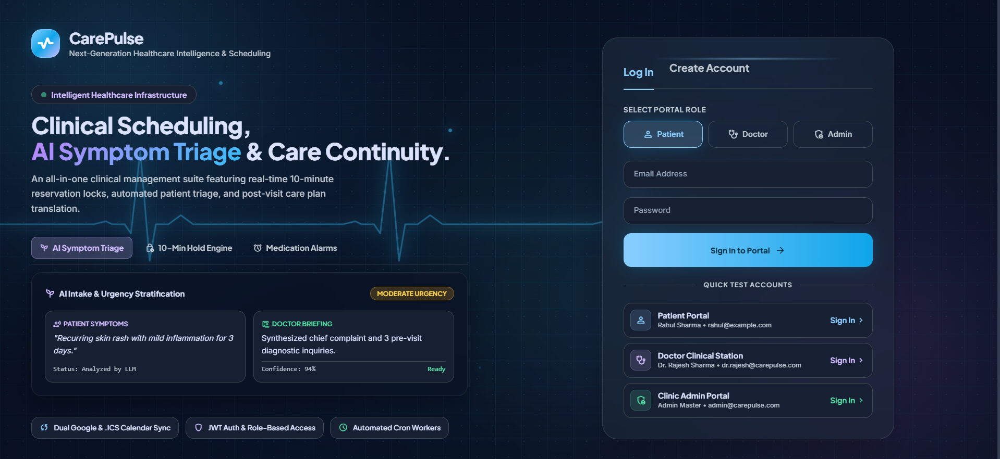
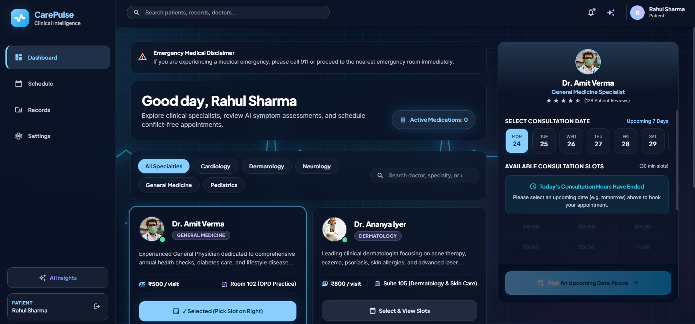
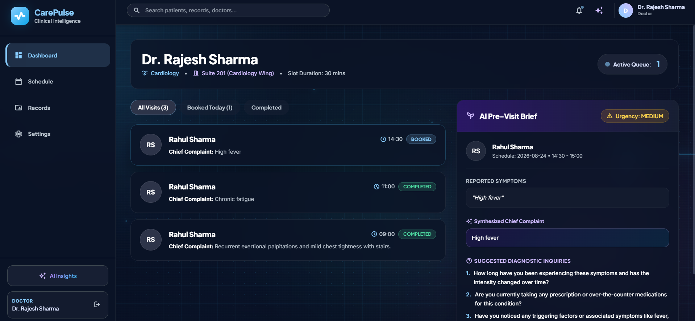
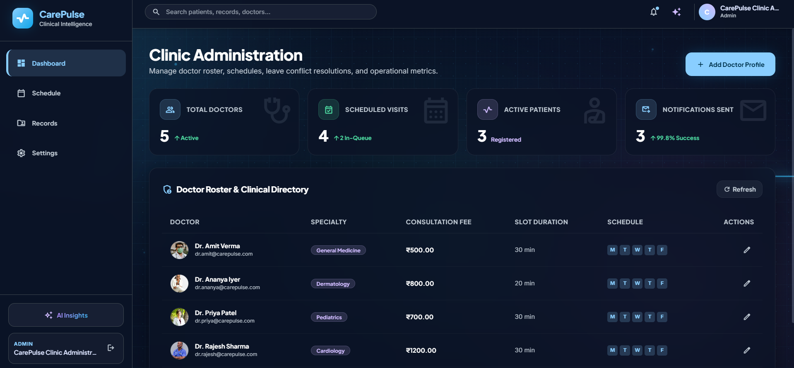

# 🏥 CarePulse — AI-Powered Healthcare Appointment & Clinical Intelligence Platform

[](https://www.typescriptlang.org/)
[](https://react.dev/)
[](https://vitejs.dev/)
[](https://nodejs.org/)
[](https://expressjs.com/)
[](https://www.postgresql.org/)
[](https://neon.tech/)
[](https://www.prisma.io/)
[](https://tailwindcss.com/)
[](https://ai.google.dev/)

A full-stack healthcare appointment management platform engineered with modern dark-mode clinical glassmorphism, animated WebGL backgrounds, AI-powered symptom triage, post-visit clinical translations, calendar synchronization, temporary appointment holds, and automated medication reminders.

---

## 🖥️ Application Preview

### 🔐 Authentication & Portal Access



### 👤 Patient Portal — Specialist Discovery & Slot Booking



### 🩺 Doctor Clinical Station — AI Pre-Visit Brief & Patient Queue



### 👑 Clinic Administration — Telemetry & Schedule Management



## 🌐 Live Demo

**Live Application:** [CarePulse](https://carepulse-healthcare.vercel.app)

---

## 📑 Table of Contents

1. [Tech Stack](#-tech-stack)
2. [Core System Capabilities](#-core-system-capabilities)
3. [Key Architectural Highlights](#-key-architectural-highlights)
4. [Testing Credentials](#-testing-credentials)
5. [Directory Structure](#-directory-structure)
6. [Getting Started](#-getting-started)
7. [Environment Variables](#-environment-variables)
8. [API Endpoint Reference](#-api-endpoint-reference)
9. [Deployment Architecture](#-deployment-architecture)
10. [License](#-license)

---

## 🛠️ Tech Stack

### Frontend

* **Framework:** React 18 with Vite
* **Language:** TypeScript
* **Styling:** Tailwind CSS with custom glassmorphism design tokens
* **Interactive Background:** Custom WebGL canvas and clinical ECG pulse effects
* **Icons:** Google Material Symbols Outlined & Lucide React
* **State Management:** React Context API with JWT-based authentication

### Backend & Database

* **Runtime:** Node.js 18+ with Express.js REST API
* **Language:** TypeScript
* **ORM:** Prisma
* **Database:** Neon Cloud PostgreSQL
* **Authentication:** JWT with `jsonwebtoken`
* **Password Security:** `bcryptjs`
* **Validation:** Zod

### AI & Clinical Intelligence

* **Primary AI Engines:** Google Gemini API and OpenAI API
* **Symptom Triage:** AI-assisted urgency classification (`LOW`, `MEDIUM`, `HIGH`)
* **Fallback Engine:** Deterministic rule-based triage fallback for temporary AI API failures or rate limits

### Automation & Communications

* **Scheduled Workers:** `node-cron`
* **Slot Hold Management:** Expired hold cleanup
* **Medication Reminders:** Automated scheduled alerts
* **Email:** Nodemailer with HTML clinical templates and retry logging
* **Calendar:** Google Calendar OAuth2 + RFC-5545 `.ics` generation

---

# 🌟 Core System Capabilities

## 1. 👤 Patient Portal

* **Specialist Discovery:** Browse specialists across Cardiology, Dermatology, Neurology, General Medicine, and Pediatrics.
* **Slot Booking:** Real-time appointment availability with a **10-minute temporary slot hold**.
* **Double-Booking Prevention:** Database-level uniqueness constraints combined with transactional booking logic.
* **AI Symptom Triage:** Pre-visit questionnaire with urgency assessment and suggested diagnostic questions.
* **Consultation Schedule:** View upcoming and completed appointments with `.ics` calendar downloads.
* **Medication Reminders:** Prescription schedules with dosage, frequency, meal instructions, and automated alerts.
* **AI Clinical Insights:** Interactive symptom checker and clinical platform insights.

## 2. 🩺 Doctor Clinical Station

* **Live Patient Queue:** Chronological daily appointment queue.
* **AI Pre-Visit Brief:** Chief complaint summaries, urgency indicators, and AI-generated diagnostic questions.
* **Consultation Builder:** Create diagnoses, prescriptions, dosage instructions, and medication schedules.
* **AI Care Plan Translation:** Convert complex clinical instructions into clearer patient-friendly guidance.
* **Medication Automation:** Automatically create reminder schedules from prescribed medications.

## 3. 👑 Clinic Administration Portal

* **Real-Time KPIs:** Doctors, appointments, patients, and notification delivery metrics.
* **Specialist Management:** Configure consultation fees, rooms, working hours, and slot durations.
* **Doctor Leave Management:** Identify conflicting appointments and transition affected bookings to `REQUIRES_RESCHEDULE`.
* **Rescheduling Notifications:** Automatically send patients direct rescheduling links.
* **Notification Audit Log:** Track pending, sent, and failed transactional notifications.

---

# 🏗️ Key Architectural Highlights

### Double-Booking Prevention

CarePulse combines:

1. Application-level availability checks
2. Prisma transactions for the booking workflow
3. A database unique constraint on `(doctorId, date, startTime)`

The database constraint provides the final protection against concurrent conflicting bookings.

### 10-Minute Slot Holds

A `SlotHold` record temporarily reserves a selected slot using a unique `holdToken` and `expiresAt` timestamp.

Expired holds are ignored by availability queries and can also be explicitly released.

### Doctor Leave Handling

Existing bookings affected by doctor leave transition to:

```text
REQUIRES_RESCHEDULE
```

instead of being treated as simple cancellations. Patients receive a direct rescheduling link.

### Reliable Notifications

Notifications are persisted in `NotificationLog` with:

```text
PENDING
SENT
FAILED
```

Failed deliveries record the error and retry count. Background workers can retry failed notifications without causing the original appointment or consultation operation to fail.

For detailed architecture and failure-handling decisions, see [`SYSTEM_DESIGN.md`](SYSTEM_DESIGN.md).

---

# 🔑 Testing Credentials

The following accounts are pre-seeded for local/demo testing.

### 👑 Administration

| Role  | Email                 | Password   |
| ----- | --------------------- | ---------- |
| Admin | `admin@carepulse.com` | `admin123` |

### 🩺 Doctors

| Specialist          | Field            | Email                     | Password    |
| ------------------- | ---------------- | ------------------------- | ----------- |
| Dr. Rajesh Sharma   | Cardiology       | `dr.rajesh@carepulse.com` | `doctor123` |
| Dr. Ananya Iyer     | Dermatology      | `dr.ananya@carepulse.com` | `doctor123` |
| Dr. Vikram Malhotra | Neurology        | `dr.vikram@carepulse.com` | `doctor123` |
| Dr. Amit Verma      | General Medicine | `dr.amit@carepulse.com`   | `doctor123` |
| Dr. Priya Patel     | Pediatrics       | `dr.priya@carepulse.com`  | `doctor123` |

### 👤 Patients

| Patient      | Email               | Password      |
| ------------ | ------------------- | ------------- |
| Rahul Sharma | `rahul@example.com` | `password123` |
| Pooja Verma  | `pooja@example.com` | `password123` |
| John Doe     | `john@example.com`  | `password123` |

> These credentials are intended for demo/testing environments only.

---

# 📁 Directory Structure

```text
Healthcare/
├── client/
│   ├── src/
│   │   ├── api/
│   │   ├── components/
│   │   │   ├── AIInsightsModal.tsx
│   │   │   ├── CarePulseBackground.tsx
│   │   │   ├── FluidShaderCanvas.tsx
│   │   │   ├── PrescriptionModal.tsx
│   │   │   ├── Sidebar.tsx
│   │   │   ├── SymptomModal.tsx
│   │   │   └── TopAppBar.tsx
│   │   ├── context/
│   │   │   └── AuthContext.tsx
│   │   ├── pages/
│   │   │   ├── AdminDashboard.tsx
│   │   │   ├── AuthPage.tsx
│   │   │   ├── DoctorDashboard.tsx
│   │   │   └── PatientDashboard.tsx
│   │   ├── types/
│   │   ├── App.tsx
│   │   ├── index.css
│   │   └── main.tsx
│   ├── package.json
│   └── vite.config.ts
│
├── server/
│   ├── prisma/
│   │   └── schema.prisma
│   ├── src/
│   │   ├── middleware/
│   │   ├── routes/
│   │   │   ├── admin.routes.ts
│   │   │   ├── appointment.routes.ts
│   │   │   ├── auth.routes.ts
│   │   │   ├── consultation.routes.ts
│   │   │   ├── doctor.routes.ts
│   │   │   └── notification.routes.ts
│   │   ├── services/
│   │   │   ├── calendar.service.ts
│   │   │   ├── email.service.ts
│   │   │   ├── llm.service.ts
│   │   │   └── scheduler.service.ts
│   │   ├── db.ts
│   │   ├── index.ts
│   │   ├── seed.ts
│   │   └── types.ts
│   ├── package.json
│   └── tsconfig.json
│
├── SYSTEM_DESIGN.md
├── .env.example
├── package.json
└── README.md
```

---

# 🚀 Getting Started

## 1. Prerequisites

* Node.js 18+
* npm 9+
* Neon PostgreSQL database

## 2. Clone Repository

```bash
git clone https://github.com/Sujal-tyagi17/Healthcare-Appointment.git
cd Healthcare-Appointment
```

## 3. Install Dependencies

```bash
npm run install:all
```

## 4. Configure Environment Variables

Create `server/.env` from `.env.example`:

### Windows PowerShell

```powershell
copy .env.example server\.env
```

### Linux / macOS

```bash
cp .env.example server/.env
```

Set your Neon PostgreSQL connection string:

```env
DATABASE_URL="your-neon-postgresql-connection-string"
```

Add the required JWT, AI, SMTP, and Google Calendar credentials as needed.

## 5. Initialize Database

Push the Prisma schema to Neon:

```bash
npx prisma db push
```

Seed the demo users and data:

```bash
npm run seed
```

## 6. Start Development Server

```bash
npm run dev
```

Frontend:

```text
http://localhost:5173
```

Backend API:

```text
http://localhost:5000/api
```

---

# ⚙️ Environment Variables

| Variable               | Description                       | Required |
| ---------------------- | --------------------------------- | -------- |
| `PORT`                 | Backend HTTP port                 | No       |
| `NODE_ENV`             | Environment mode                  | No       |
| `DATABASE_URL`         | Neon PostgreSQL connection string | Yes      |
| `JWT_SECRET`           | JWT signing secret                | Yes      |
| `CLIENT_URL`           | Frontend URL for CORS             | Yes      |
| `GEMINI_API_KEY`       | Google Gemini API key             | Optional |
| `OPENAI_API_KEY`       | OpenAI API key                    | Optional |
| `SMTP_HOST`            | SMTP server                       | Optional |
| `SMTP_PORT`            | SMTP port                         | Optional |
| `SMTP_USER`            | SMTP username                     | Optional |
| `SMTP_PASS`            | SMTP app password                 | Optional |
| `GOOGLE_CLIENT_ID`     | Google OAuth client ID            | Optional |
| `GOOGLE_CLIENT_SECRET` | Google OAuth client secret        | Optional |
| `GOOGLE_REFRESH_TOKEN` | Google OAuth refresh token        | Optional |

> Never commit `.env` files, API keys, database passwords, or OAuth secrets to GitHub.

---

# 📡 API Endpoint Reference

### Authentication

```text
POST /api/auth/register
POST /api/auth/login
GET  /api/auth/me
```

### Doctors & Availability

```text
GET /api/doctors
GET /api/doctors/:id/availability?date=YYYY-MM-DD
```

### Appointments

```text
POST   /api/appointments/hold
DELETE /api/appointments/hold/:token
POST   /api/appointments/book
GET    /api/appointments
DELETE /api/appointments/:id
GET    /api/appointments/:id/ics
POST   /api/appointments/analyze-symptoms
```

### Consultations

```text
POST  /api/consultations/:id/post-visit
GET   /api/consultations/medications
PATCH /api/consultations/medications/:id/toggle
```

### Administration

```text
GET    /api/admin/analytics
POST   /api/admin/doctors/:id/leave
GET    /api/admin/doctors/:id/leaves
DELETE /api/admin/doctors/:id/leaves/:date
GET    /api/notifications
```

---

# 🌐 Deployment Architecture

CarePulse uses a **split deployment architecture**:

```text
                 ┌────────────────────┐
                 │       Vercel       │
                 │   React + Vite     │
                 │      /client      │
                 └─────────┬──────────┘
                           │
                           │ HTTPS API
                           ▼
                 ┌────────────────────┐
                 │ Railway / Render  │
                 │ Express + Prisma  │
                 │      /server      │
                 └─────────┬──────────┘
                           │
                           │ DATABASE_URL
                           ▼
                 ┌────────────────────┐
                 │   Neon PostgreSQL  │
                 │ Cloud Database     │
                 └────────────────────┘
```

## Frontend — Vercel

Configure:

```text
Root Directory: client
Framework: Vite
Build Command: npm run build
Output Directory: dist
```

Set:

```env
VITE_API_URL=https://your-backend-url/api
```

## Backend — Railway / Render

Configure:

```text
Root Directory: server
Build Command: npm install && npm run build && npx prisma db push
Start Command: node dist/index.js
```

Set the required backend environment variables, including:

```env
DATABASE_URL=your-neon-postgresql-connection-string
CLIENT_URL=https://your-frontend-url
JWT_SECRET=your-secure-jwt-secret
```

Run the seed command only when the deployment requires demo data:

```bash
npm run seed
```

---

# 📜 License

Distributed under the **MIT License**.

Created for modern clinical operations with a focus on reliable appointment management, AI-assisted workflows, and patient follow-up automation.
