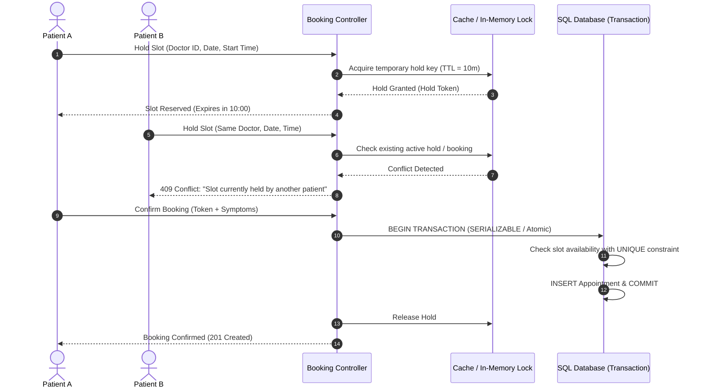
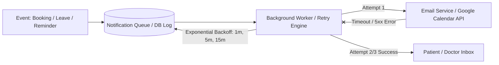

# System Design Write-Up: Healthcare Appointment & Follow-up Manager

## 1. Concurrency Control & Double-Booking Prevention

Preventing double-booking in high-concurrency environments requires multi-tiered isolation to eliminate race conditions between the time a user selects a slot and commits the booking.

1. **Optimistic Temporary Slot Holds**: When a patient selects an available slot to fill symptoms, a temporary hold key is created with a 10-minute Time-To-Live (TTL). Other clients querying availability see the slot as `HELD`.
2. **Database-Level Integrity Constraints**: The `Appointment` table enforces a composite unique constraint `UNIQUE(doctor_id, appointment_date, start_time)` filtered on non-cancelled statuses (`BOOKED`, `COMPLETED`).
3. **Atomic Database Transactions**: The booking confirmation executes inside an ACID transaction (`prisma.$transaction` / SQL transaction with row-level locks). If two simultaneous requests pass the hold layer, the database enforces the unique constraint, failing the second request deterministically with an HTTP `409 Conflict` response.

---

## 2. Temporary Slot Hold Mechanism

To provide a seamless user experience during symptom input:
- **Hold Allocation**: Requesting a slot triggers `POST /api/appointments/hold`. The system validates that the slot is within the doctor's working hours, not on a declared leave date, and has no active booking or unexpired hold.
- **TTL Expiration**: A background reconciliation worker runs every 60 seconds to purge expired holds (`held_until < CURRENT_TIMESTAMP`). When a hold expires, the slot returns to the public availability pool automatically.
- **Hold Renewal & Abandonment**: If the patient navigates away or cancels, an explicit `DELETE /api/appointments/hold/:token` frees the slot immediately.

---

## 3. Doctor Leave Conflict Handling

When an Admin or Doctor marks a doctor as on leave for a specific date or date range:

1. **Atomic Leave Registration**: The leave date is saved in `DoctorLeave`. All future slot generation endpoints immediately exclude this date.
2. **Conflicting Booking Detection**: A transactional query identifies all active appointments (`status = 'BOOKED'`) for that doctor on the affected date(s).
3. **Batch Status Transition**: Conflicting appointments are updated in bulk to `REQUIRES_RESCHEDULE` or `CANCELLED_BY_DOCTOR`.
4. **Automated Patient Notification & Priority Rescheduling**:
   - For every affected appointment, an automated priority notification is pushed to the notification queue.
   - The email contains an apology, the reason for cancellation, and a secure, pre-authenticated one-click rescheduling link granting the patient priority access to alternative slots.

---

## 4. Notification Failure & Reliability Architecture

Healthcare notifications (booking confirmations, doctor leave alerts, medication reminders) are critical and must be resilient against third-party network outages (SMTP/SendGrid/Google Calendar API downtime).

- **Outbox Pattern / Database-Backed Queue**: Notification tasks are written into the `NotificationLog` table inside the triggering transaction (`status = 'PENDING'`).
- **Idempotency**: Every notification event receives a unique deterministic key `(appointment_id, event_type, recipient_email)` to guarantee no duplicate emails are sent during retries.
- **Exponential Backoff Worker**: A background scheduler processes pending and failed notifications:
  - Max retry count: 3 attempts with exponential backoff intervals (1 minute, 5 minutes, 15 minutes).
  - Dead Letter Handling: If all 3 attempts fail, the notification is marked `FAILED` with the exact error payload recorded for admin inspection.
- **Fail-Safe LLM Processing**: LLM calls for pre-visit and post-visit summaries are wrapped in timeout-protected handlers with a deterministic heuristic fallback engine, ensuring API requests complete even during OpenAI/Gemini rate limits.
